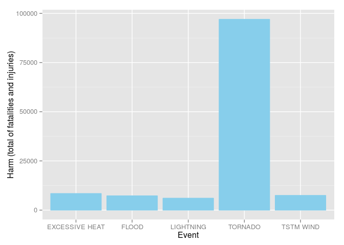
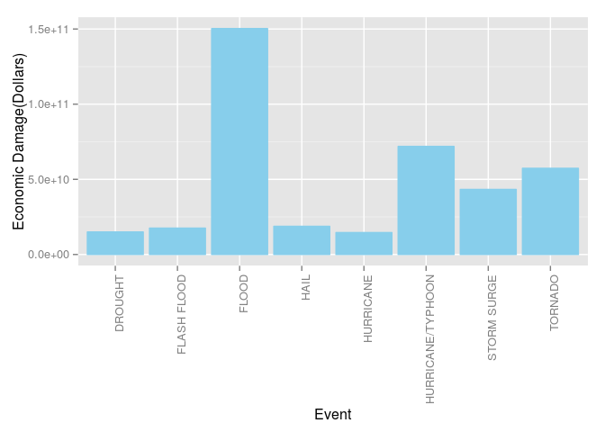

# Public health and economic problems caused by severe weather events

## Introduction
Severe weather conditions can affect the healh of the USA population. Also, economiic problems can be raised due to material damages on prperties and crops wich can reach millions of dollars. During several years  U.S. National Oceanic and Atmospheric Administration's (NOAA) has gathered information of different weather events and kept the information on a database(https://d396qusza40orc.cloudfront.net/repdata%2Fdata%2FStormData.csv.bz2). We extracted information from the data base and analyze it in order to answer following questions:

1. Across the United States, which types of events are most harmful with respect to population health?
2. Across the United States, which types of events have the greatest economic consequences?

## Data Processing

The information is stored in a .bz2 file separated by comma which contains information of weather conditions recolected within USA.

### Read CSV file and verify its contents
I used two libraries of R to manipulate the information and to show plots results.


```r
setwd("/home/jandas/R/courseraR/RepResearch/Project2/data")
# Call libraries
library(dplyr)
```

```
## 
## Attaching package: 'dplyr'
## 
## The following objects are masked from 'package:stats':
## 
##     filter, lag
## 
## The following objects are masked from 'package:base':
## 
##     intersect, setdiff, setequal, union
```

```r
library(ggplot2)

# Read 
StormData <- read.csv("repdata-data-StormData.csv.bz2")
```


### Look for most harmful events.
Execute a summery of EVTYPE which contains the events.

Fields containing the number of injuries and fatalities are INJURIES and FATALITIES respectively. We summarize both fields to verify the information.


```r
summary(StormData$FATALITIES)
```

```
##     Min.  1st Qu.   Median     Mean  3rd Qu.     Max. 
##   0.0000   0.0000   0.0000   0.0168   0.0000 583.0000
```

```r
summary(StormData$INJURIES)
```

```
##      Min.   1st Qu.    Median      Mean   3rd Qu.      Max. 
##    0.0000    0.0000    0.0000    0.1557    0.0000 1700.0000
```


To get information by event we group the amount of fatalities and injuries to verify which are the most harmful.


```r
df <-group_by(StormData, EVTYPE)
df_sum <- summarize(df, HealthHarm=sum(FATALITIES,INJURIES))
adf_sum<-arrange(df_sum, desc(HealthHarm))
```

We get the top five and verify if they are the most harmful. This is done geting the % from the total.

```r
MostHarmful<-head(adf_sum, n=5)
#print(MostHarmful)
sum(MostHarmful$HealthHarm)/sum(df_sum$HealthHarm)
```

```
## [1] 0.8105002
```

Top 5 is 81% of health harmfuly events. Therefore, we plot the information to verify it.

```r
MostHarmful$EVTYPE<-factor(MostHarmful$EVTYPE)

ggplot(MostHarmful, aes(x = EVTYPE, y = HealthHarm)) + geom_bar(stat = "identity", fill="Skyblue", colour="Skyblue")+ labs(x= "Event") + labs(y= "Harm (total of fatalities and injuries)")
```

 

  Figure1. This figure shows the 5 most harmful events which have 81% of the fatalities and injuries related to severe weather conditions. 

### Look for information of economic problems by events.
Field containing information of cost of damaged properites is PROPDMG. Also, the exponential of the amount is stored on PROPDMGEXP. Besides, severe weather conditions can afect crops. Hence, the data base contains a field called CROPDMG where the cost on crop damages is stored. Also, it has an exponential which is stored in CROPDMGEXP.


### Verify the values of the variables

```r
summary(StormData$PROPDMG)
```

```
##    Min. 1st Qu.  Median    Mean 3rd Qu.    Max. 
##    0.00    0.00    0.00   12.06    0.50 5000.00
```

```r
levels(StormData$PROPDMGEXP)
```

```
##  [1] ""  "-" "?" "+" "0" "1" "2" "3" "4" "5" "6" "7" "8" "B" "h" "H" "K"
## [18] "m" "M"
```

```r
summary(StormData$CROPDMG)
```

```
##    Min. 1st Qu.  Median    Mean 3rd Qu.    Max. 
##   0.000   0.000   0.000   1.527   0.000 990.000
```

```r
levels(StormData$CROPDMGEXP)
```

```
## [1] ""  "?" "0" "2" "B" "k" "K" "m" "M"
```

To get the correct amount we have to multiply the cost by the exponent on each of the fields. The values on EXP fields should be manipulate to get the correct amounts. Where:
"k" and "K" is equal to 1,000.
"m" and "M" is equal to 1,000,000.
"b" and "B" is equal to 1,000,000,000.

Other numbers are trated as same number and special characters as null. 


```r
StormData$exp <- ifelse(StormData$PROPDMGEXP %in% c("k","K"), 
                    1000, 
                        ifelse(df$PROPDMGEXP %in% c("m","M"), 
                            1000000,
                            ifelse(df$PROPDMGEXP %in% c("b","B"), 
                                1000000000,
                                ifelse(df$PROPDMGEXP %in% c("0", "1", "2", "3", "4", "5", "6", "7", "8"), 
                                    as.numeric(df$PROPDMGEXP),
                                        NA          
                                )
                            )
                        )
                    )
```

Then we multiply Property damage amount (PROPDMG) by exp.


```r
StormData$PROPERTY_DAMAGE <- ifelse(is.na(StormData$exp),StormData$PROPDMG, StormData$PROPDMG*StormData$exp)
```

We do same operations for Crop damages


```r
StormData$expC <- ifelse(StormData$CROPDMGEXP %in% c("k","K"), 
                        1000, 
                        ifelse(StormData$CROPDMGEXP %in% c("m","M"), 
                               1000000,
                               ifelse(StormData$CROPDMGEXP %in% c("b","B"), 
                                      1000000000,
                                      ifelse(StormData$CROPDMGEXP %in% c("0", "1", "2", "3", "4", "5", "6", "7", "8"), 
                                             as.numeric(StormData$CROPDMGEXP),
                                             NA          
                                      )
                               )
                        )
)
```

Then we multiply Property damage amount (PROPDMG) by exp


```r
StormData$CROP_DAMAGE <- ifelse(is.na(StormData$expC),StormData$CROPDMG, StormData$CROPDMG*StormData$expC)
```

Then we group by Event and sum Property damage and crop damage to get the total amount of damage


```r
df <-group_by(StormData, EVTYPE)
df_cost <- summarize(df, DAMAGE=sum(PROPERTY_DAMAGE,CROP_DAMAGE))
adf_cost<-arrange(df_cost, desc(DAMAGE))
```

We look into the infor to verify if top 5 are most representative events


```r
MostCostly<-head(adf_cost, n=5)
sum(MostCostly$DAMAGE)/sum(df_cost$DAMAGE)
```

```
## [1] 0.7171513
```

We see that top five is below 80% we try with top 8.


```r
MostCostly<-head(adf_cost, n=8)
sum(MostCostly$DAMAGE)/sum(df_cost$DAMAGE)
```

```
## [1] 0.8162041
```


Top ten is 81% we use them and plot it.


```r
MostHarmful$EVTYPE<-factor(MostHarmful$EVTYPE)
ggplot(MostCostly, aes(x = EVTYPE, y = DAMAGE)) + geom_bar(stat = "identity", fill="Skyblue", colour="Skyblue") + theme(axis.text.x = element_text(angle = 90, hjust = 1))+ labs(x= "Event") + labs(y= "Economic Damage(Dollars)")
```

 

  Figure2. This figure shows the 8 events with greates economic consecuenses.

## Results

1. Across the United States, which types of events (as indicated in the EVTYPE variable) are most harmful with respect to population health?
Only 5 events are causing more than 80% of total harmful. These events are tornados, excessive heat, TSTM wind, flood and lighting 
2. Across the United States, which types of events have the greatest economic consequences?
Flood, Hurricane/Thyphoon, Tornado, Storm Surge, Hail, Flash Flood, Huricane, adn drought are the 8 events that have the greatest economic consequences. These 8 events generates the 80% of total material damages in the USA.
